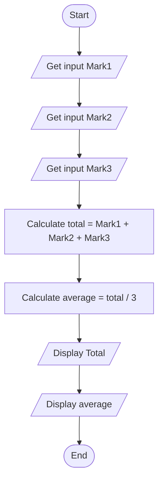
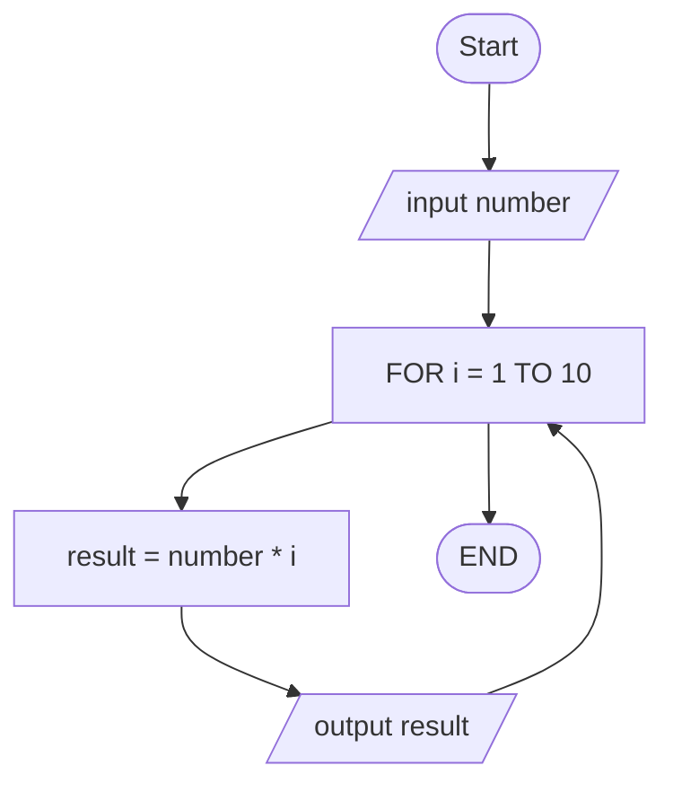
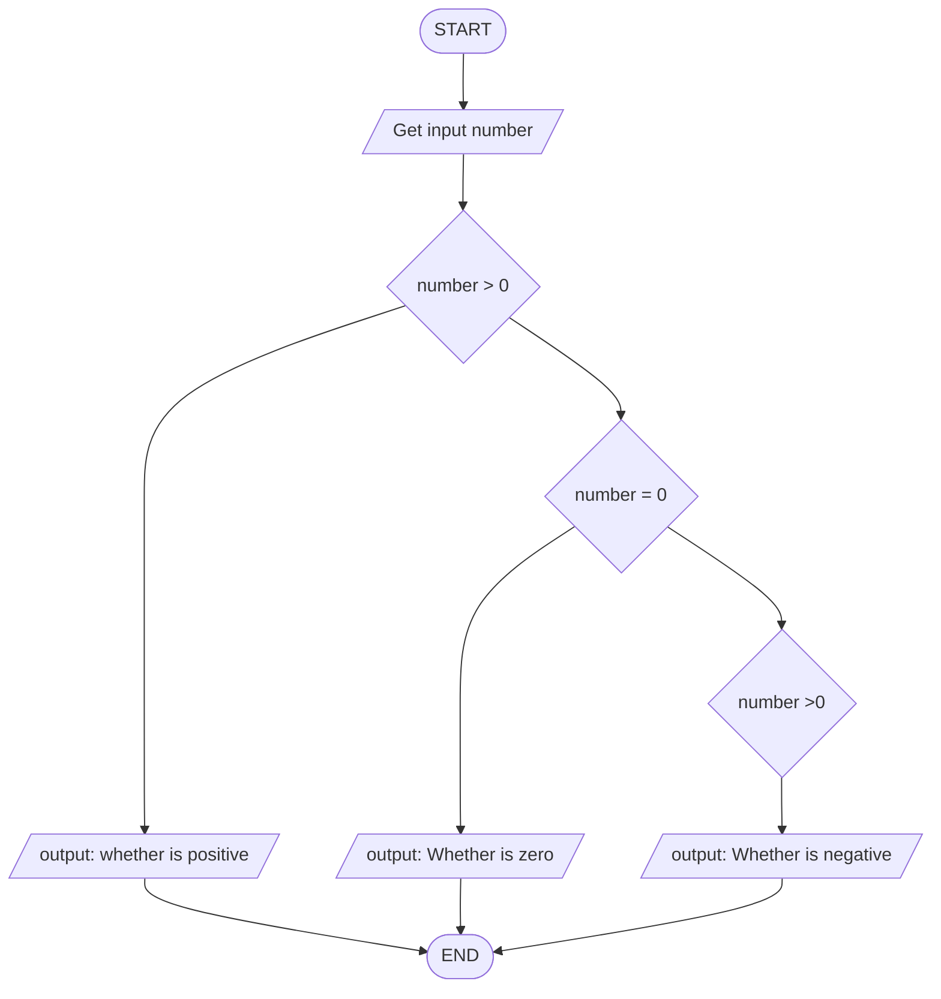
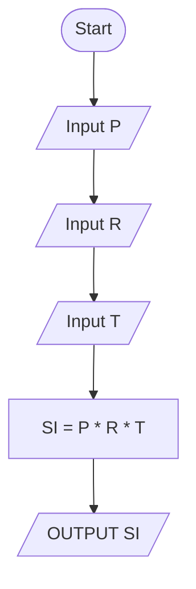
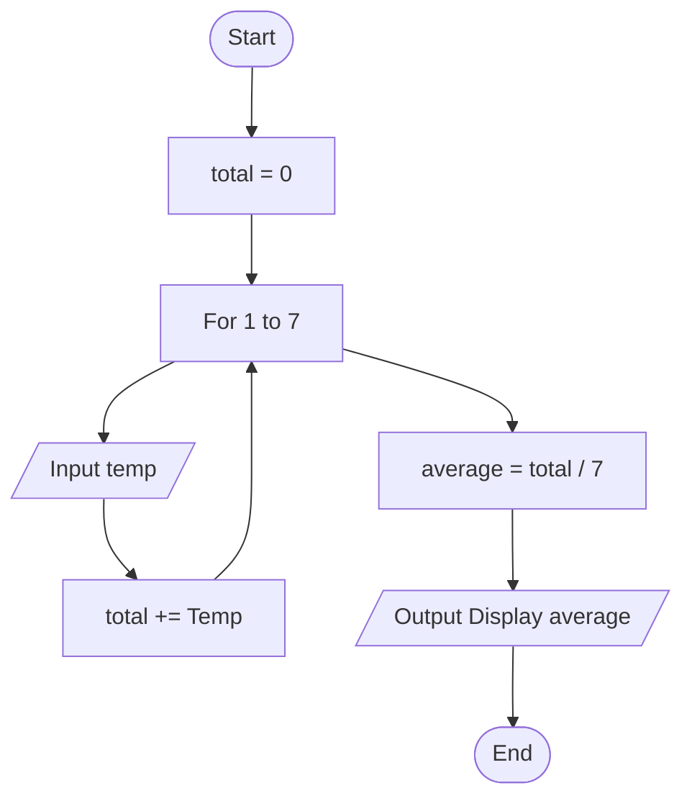
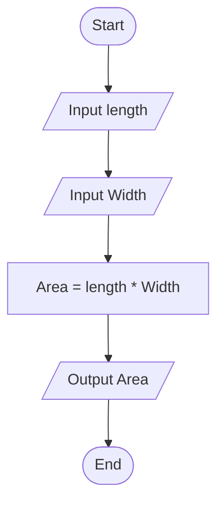

# Workshop: Algorithm and Flowchart

## 2.Calculate Total and Average Marks

Write the algorithm and draw the flowchart for a program that inputs
marks for 3 subjects, calculates the total and average, and displays
both.

---
### Answer: 
#### ✔ Pseudocode
```text
START
    INPUT Mark1
    INPUT Mark2
    INPUT Mark3

    total=Mark1 + Mark2 + Mark3
    average = total / 3

    OUTPUT total
    OUTPUT average

END
```

#### ✔ Flowchart

---
## 3. Display Multiplication Table
Create an algorithm and flowchart that input a number and display its
multiplication table from 1 to 10 using a loop.

### Answer: 
#### ✔ Pseudocode
```text
START
    INPUT number

    FOR 1 TO 10
        result = number * i
        OUTPUT number , " x ", i , " = ", result
    END FOR

    END

```

#### ✔ Flowchart


## 4. Positive, Negative, or Zero Check
Write the algorithm and flowchart to input a number and display whether
it is positive, negative, or zero.

### Answer: 
#### ✔ Pseudocode
```text
    START
    INPUT number
    IF number > 0 Then
        Display " Whether is positive"
    IF number == 0 Then
        Display "Whether is zero"
    IF number < 0 Then
        Display "Whether is negative"
    EndIf

End
```
#### ✔ Flowchart

## 5. Simple Interest Calculator

Create an algorithm and flowchart for a program that calculates simple
interest using the formula:

**SI = (P × R × T) / 100**

- **P = Principal** → original amount of money
- **R = Rate of Interest** → percentage per year
- **T = Time** → number of years
### Answer: 
#### ✔ Pseudocode
```text
    INPUT P
    INPUT R
    INPUT T

    SI = P * R * T

    OUTPUT SI

```


#### ✔ Flowchart


---

## 6. Average Temperature Calculation
Write the algorithm and draw the flowchart for a program that takes the
temperature of 7 days, finds the average temperature, and displays it.

### Answer: 
#### ✔ Pseudocode
```text
START
    Set total = 0
    For 1 to 7
        Input Temp
        total += Temp
    End For

average = total / 7
Output Display average
End


```

#### ✔ Flowchart

---

## 7. Calculate Area of a Rectangle

Create an algorithm and flowchart to input length and width, calculate
the area (**Area = Length × Width**), and display the result.

### Answer: 
#### ✔ Pseudocode
```text
Start
    Input length
    Input Width

    Calculate Area = length * width

    Display Area
```

#### ✔ Flowchart

---

## 8. Determine Pass or Fail

Write the algorithm and draw the flowchart for a program that takes a
student's average marks and displays **"Pass"** if average ≥ 50,
otherwise **"Fail"**.
### Answer: 
#### ✔ Pseudocode
```text

```
#### ✔ Flowchart
```mermaid
```

---

## 9. Calculate Factorial of a Number

Write the algorithm and draw the flowchart that input a number and
calculate its factorial using a loop.
### Answer: 
#### ✔ Pseudocode
```text
```
#### ✔ Flowchart
```mermaid
```

---

## 10. Calculate Discount on Purchase

Write the algorithm and draw the flowchart for a program that inputs the
purchase amount and gives a **10% discount** if the amount is greater
than 1000.
### Answer: 
#### ✔ Pseudocode
```text
```
#### ✔ Flowchart
```mermaid
```

---